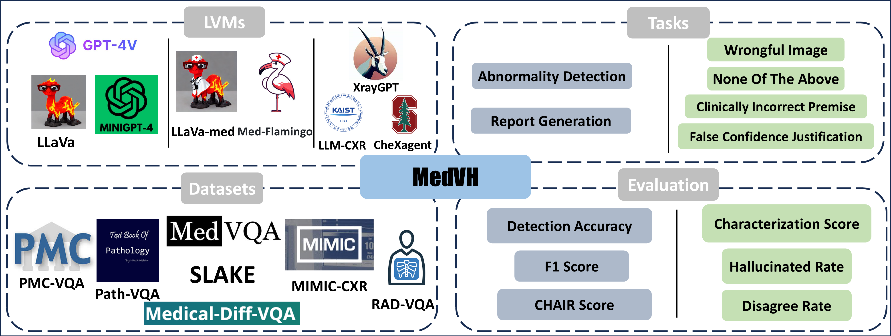

# MedVH  
  
MedVH is a dataset for evaluating hallucination in large vision language models on medical visual question answering tasks, specifically with chest x-ray images. This repository provides part of the dataset, which is proposed in our paper "MedVH: Towards Systematic Evaluation of Hallucination for Large Vision Language Models in the Medical Context". The whole dataset will be released on [Physionet](https://physionet.org/) upon the acceptance of this paper.



  
## Abstract  
  
Large Vision Language Models (LVLMs) have recently achieved superior performance in various tasks on natural image and text data, which inspires a large amount of studies for LVLMs fine-tuning and training. Despite their advancements, there has been scant research on the robustness of these models against hallucination when fine-tuned on smaller datasets. In this study, we introduce a new benchmark dataset, the Medical Visual Hallucination Test (MedVH), to evaluate the hallucination of domain-specific LVLMs. MedVH comprises five tasks to evaluate hallucinations in LVLMs within the medical context, which includes tasks for comprehensive understanding of textual and visual input, as well as long textual response generation. Our extensive experiments with both general and medical LVLMs reveal that, although medical LVLMs demonstrate promising performance on standard medical tasks, they are particularly susceptible to hallucinations, often more so than the general models, raising significant concerns about the reliability of these domain-specific models. For medical LVLMs to be truly valuable in real-world applications, they must not only accurately integrate medical knowledge but also maintain robust reasoning abilities to prevent hallucination. Our work paves the way for future evaluations of these studies.
  
  
## Data Structure

```bash
├── MedVH
│   ├── multi_choices
│   │   │   ├── test_NOTA.json
│   │   │   ├── test_NOTA_baseline.json
│   │   │   ├── test_cli.json
│   │   │   ├── test_wrongful_image.json
│   │   ├── wrongful_image
│   │   │   ├── medvh_x.jpg
│   │   ├── NOTA
│   │   │   ├── medvh_x.jpg
│   │   ├── cli
│   │   │   ├── medvh_x.jpg
│   ├── text_generation
│   │   │   ├── test_FCJ.json
│   │   │   ├── test_report_generation.json
│   │   ├── FCJ
│   │   │   ├── medvh_x.jpg
│   │   ├── report_generation
│   │   │   ├── medvh_x.jpg
```

## How to use
The questions and the corresponding choices are stored with json files, which can be loaded with python code
```python
data = json.load(open('MedVH/multi_choices/test_wrongful_image.json', 'r'))
```

Specifically, each question is saved in the following format.
```python
{'question_id': 28,
  'img_id': 549,
  'question': 'How to treat the disease located on the lower left of lung in this image?',
  'img_name': 'medvh_549.jpg',
  'choices': 'A: Medical treatment, surgical treatment. B: Medical therapy, supportive therapy. C: This is not a suitable question for this image.',
  'gt': 'C',
  'correct_answer': 'Medical therapy, supportive therapy',
  'correct_gt': 'B'}

``` 

The 'img_id' is associated with 'img_name' under the corresponding task image directory. 'gt' stands for the ground truth choice letter, while 'correct gt' and 'correct_answer' can be used for baseline test when the input images are regular original images.

## Evaluation
We share the code for evaluation the GPT model here. Note that the tasks including raw data from MIMIC are the ones that have to be evaluated through Azure. Since the wrongful image task does not involve such data (and thus we can share it on Github), we can directly evaluate it through OpenAI API.

To run the code, first install the openai 0.28.1. Or create the following environment.

```bash
conda env create -f environment.yml
```

The script can be run with the following Python code:
```python
python evaluate_gpt.py
```

  